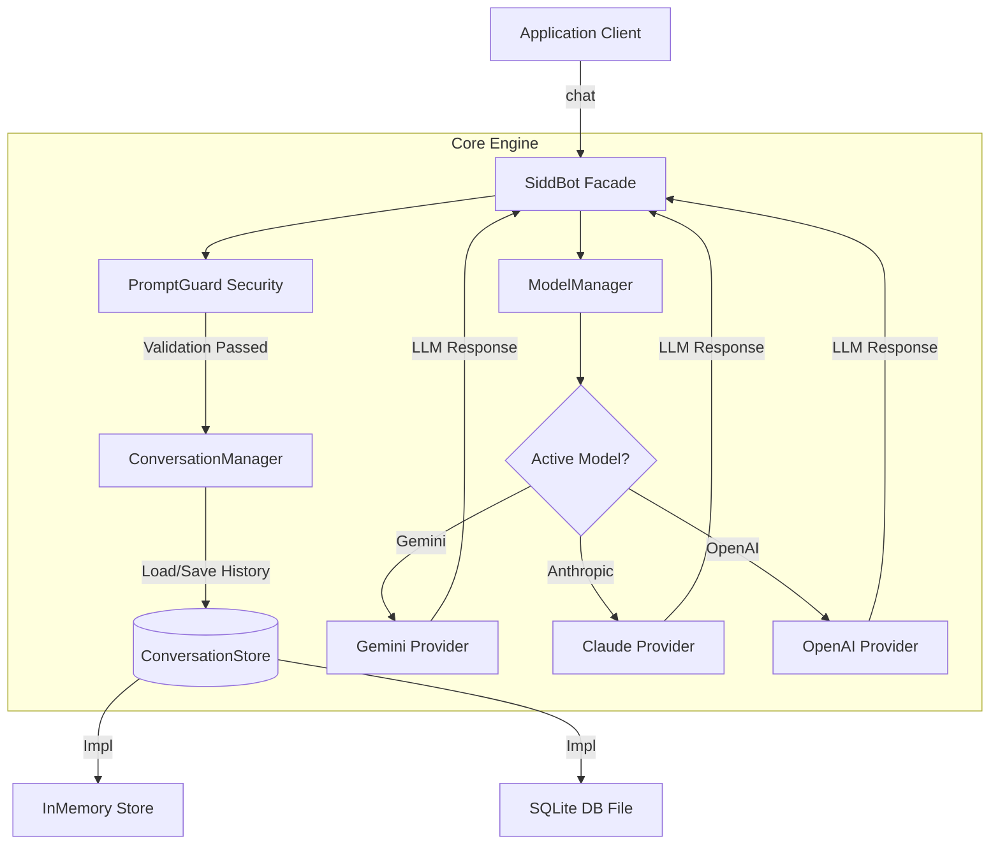

<div align="center">

  <!-- Animated Header / Typing Banner -->
  <a href="https://github.com/PRABHUSIDDARTH/sidd-bot">
    
  </a>

  <p align="center">
    <strong>A next-generation, high-performance modular AI Chatbot Framework & SDK for Java 17+</strong>
  </p>

  <!-- Badges -->
  <p align="center">
    <a href="https://java.com"></a>
    <a href="https://maven.apache.org/"></a>
    <a href="https://github.com/PRABHUSIDDARTH/sidd-bot/blob/main/LICENSE"></a>
    <a href="https://github.com/PRABHUSIDDARTH/sidd-bot/actions"></a>
    <a href="https://github.com/PRABHUSIDDARTH/sidd-bot/stargazers"></a>
  </p>

  <p align="center">
    <a href="#-key-features">Key Features</a> •
    <a href="#-quick-start">Quick Start</a> •
    <a href="#-architecture">Architecture</a> •
    <a href="#-examples">Examples</a> •
    <a href="#-installation">Installation</a>
  </p>

  <br/>
</div>

---

## 🌟 Overview

**SiddBot** is a flexible, developer-friendly Java library designed to streamline building AI-powered bots and multi-turn conversational agents. It abstracts LLM interaction, context memory, storage persistence, and prompt safety into a clean, modern **Fluent Builder API**.

```
                   ┌───────────────────────────────────────┐
                   │               SiddBot                 │
                   └──────────────────┬────────────────────┘
                                      │
        ┌─────────────────────────────┼─────────────────────────────┐
        ▼                             ▼                             ▼
┌───────────────┐             ┌───────────────┐             ┌───────────────┐
│ PromptGuard   │             │ Conversation  │             │ ModelManager  │
│ (Security)    │             │   Manager     │             │ (Multi-LLM)   │
└───────────────┘             └───────┬───────┘             └───────┬───────┘
                                      │                             │
                               ┌──────┴──────┐               ┌──────┴──────┐
                               ▼             ▼               ▼             ▼
                            InMemory      SQLite          Gemini        Claude /
                             Store        Store           Flash         OpenAI
```

---

## ⚡ Key Features

<table>
  <tr>
    <td width="50%">
      <h3 align="center">🔄 Runtime Model Switching</h3>
      <p>Register multiple providers (Google Gemini, Anthropic Claude, OpenAI) and hot-swap active models at runtime with zero downtime.</p>
    </td>
    <td width="50%">
      <h3 align="center">💾 Pluggable Persistence</h3>
      <p>Seamlessly switch between fast <code>InMemoryConversationStore</code> for lightweight workloads and <code>SqliteConversationStore</code> for zero-config local persistence.</p>
    </td>
  </tr>
  <tr>
    <td width="50%">
      <h3 align="center">🛡️ Built-in PromptGuard</h3>
      <p>Built-in security sanitization shielding your LLM pipelines from unsafe content and prompt injection attempts.</p>
    </td>
    <td width="50%">
      <h3 align="center">⚙️ Fluent Builder & Controls</h3>
      <p>Intuitive chainable builder API supporting <code>temperature</code>, <code>maxTokens</code>, <code>topP</code>, and full <code>TokenUsage</code> request tracking.</p>
    </td>
  </tr>
</table>

---

## 🚀 Quick Start

### 1. Fluent Builder Initialization

```java
import io.github.prabhusiddarth.sidd_bot.SiddBot;
import io.github.prabhusiddarth.sidd_bot.memory.StorageType;

public class App {
    public static void main(String[] args) {
        // Instantiate SiddBot with SQLite persistence & custom temperature
        SiddBot bot = SiddBot.builder()
                .storageType(StorageType.SQLITE, "my-bot-memory.db")
                .defaultModel("gemini-3.6-flash")
                .temperature(0.7)
                .build();

        // Start chatting!
        String response = bot.chat("Explain quantum computing in one sentence.");
        System.out.println("🤖 Bot: " + response);
    }
}
```

---

## 💻 Code Examples

<details>
<summary><b>1. Basic Chat (Default Setup)</b></summary>
<br>

```java
import io.github.prabhusiddarth.sidd_bot.SiddBot;

public class BasicChat {
    public static void main(String[] args) {
        SiddBot bot = new SiddBot();
        String response = bot.chat("What is the capital of France?");
        System.out.println("Bot Response: " + response);
    }
}
```
</details>

<details>
<summary><b>2. Multi-Session Conversation Tracking</b></summary>
<br>

```java
import io.github.prabhusiddarth.sidd_bot.SiddBot;

public class MultiSessionDemo {
    public static void main(String[] args) {
        SiddBot bot = new SiddBot();

        // Chat in separate session threads
        bot.chat("user-session-101", "Hello! My name is Alice.");
        bot.chat("user-session-102", "Hey there! My name is Bob.");

        // Context is automatically retained per session ID
        System.out.println(bot.chat("user-session-101", "What was my name again?")); // Alice
        System.out.println(bot.chat("user-session-102", "What was my name again?")); // Bob
    }
}
```
</details>

<details>
<summary><b>3. Hot-Swapping AI Models at Runtime</b></summary>
<br>

```java
import io.github.prabhusiddarth.sidd_bot.SiddBot;
import io.github.prabhusiddarth.sidd_bot.model.Model;
import io.github.prabhusiddarth.sidd_bot.model.Provider;

public class RuntimeModelSwitch {
    public static void main(String[] args) {
        SiddBot bot = SiddBot.builder()
                .defaultModel("gemini-3.6-flash")
                .build();

        // Switch active model on the fly to Claude 3.5 Sonnet
        Model claude = new Model("claude-3-5-sonnet", Provider.ANTHROPIC);
        bot.getModelManager().registerModel("claude", claude);
        bot.getModelManager().setActiveModel("claude");

        String response = bot.chat("Write a 4-line poem about space.");
        System.out.println(response);
    }
}
```
</details>

---

## 🏗️ Architecture



---

## 📁 Directory Structure

```text
sidd-bot/
├── pom.xml
├── README.md
├── LICENSE
└── src/
    ├── main/java/io/github/prabhusiddarth/sidd_bot/
    │   ├── SiddBot.java                  # Main Entry Facade & Fluent Builder
    │   ├── conversation/                 # Conversation & Message Entities
    │   │   ├── Conversation.java
    │   │   ├── ConversationManager.java
    │   │   ├── Message.java
    │   │   └── Role.java
    │   ├── memory/                       # Storage & Memory Persistence
    │   │   ├── ConversationStore.java
    │   │   ├── InMemoryConversationStore.java
    │   │   ├── SqliteConversationStore.java
    │   │   └── StorageType.java
    │   ├── model/                        # Provider & Model Management
    │   │   ├── Model.java
    │   │   ├── ModelManager.java
    │   │   └── Provider.java
    │   ├── generation/                   # Controls & Token Metrics
    │   │   ├── GenerationConfig.java
    │   │   └── TokenUsage.java
    │   ├── security/                     # Security & Prompt Sanitization
    │   │   └── PromptGuard.java
    │   └── examples/                     # Example Runnable Scripts
    │       ├── BasicChat.java
    │       ├── MultiConversation.java
    │       └── RuntimeModelSwitch.java
    └── test/java/                        # Unit & Integration Tests
```

---

## 🛠️ Build & Development

### Prerequisites
- **JDK 17** or higher
- **Apache Maven 3.8+**

### Building from Source
```bash
mvn clean compile
```

### Running Tests
```bash
mvn test
```

---

## 📜 License

Distributed under the **Apache License 2.0**. See [`LICENSE`](LICENSE) for more information.

<div align="center">
  <sub>Made with ❤️ by <a href="https://github.com/PRABHUSIDDARTH">Prabhu Siddarth</a></sub>
</div>
